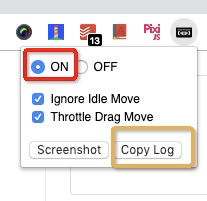
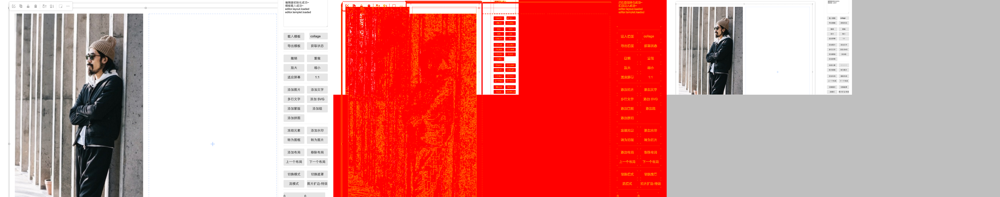

<!-- TOC GFM -->

* [背景](#背景)
* [工具](#工具)
* [快速开始](#快速开始)
    * [安装与配置](#安装与配置)
    * [测试用例使用](#测试用例使用)
        * [场景一：自己使用代码手动进行交互，然后使用插件进行截图，这里插件只负责截图和和之后的截图进行比对。](#场景一自己使用代码手动进行交互然后使用插件进行截图这里插件只负责截图和和之后的截图进行比对)
        * [场景二：使用 repeater 录制好的 json，自动回放交互行为并截图，这里插件负责动作回放和截图比对。](#场景二使用-repeater-录制好的-json自动回放交互行为并截图这里插件负责动作回放和截图比对)
    * [为什么我们需要限制浏览器启动的窗口大小？](#为什么我们需要限制浏览器启动的窗口大小)

<!-- /TOC -->
## 背景
一个网站除了功能外，还有两个重要组成部分：视觉和交互。

在平常的开发过程中，视觉和交互部分的保证我们通常使用肉眼校对和人肉交互结果校对。这个过程做多了，你基本就已经觉得很无聊和繁琐了，特别是你要一遍遍重复相同的操作时。

而这里则尝试使用尽可能的自动化的方式来解决这一繁琐的重复工作。


## 工具
除了我们的基础测试工具 cypress 外， 我们使用 `cypress-repeat-snapshot` 来做交互的自动化录制和回放以及结果的截图比对。这里感谢 甲鱼 在 雪碧 的 repeater 基础上做的一个 cypress 插件。两位大佬为此提供了便捷的工具和方案。


## 快速开始

### 安装与配置
安装 `cypress-repeat-snapshot` 插件: npm i cypress-repeat-snapshot -D
配置 cypress 使用插件。需要配置两处，`plugin/index.js` 和 `support/commands.js`， 分别是注册功能和命令。见代码内箭头指向部分
除了配置插件外，我们在 `plugin/index.js` 上配置了浏览器启动的窗口大小，这个是为了保证每次截图的一致性, 具体请查看 [为什么我们需要限制浏览器启动的窗口大小](#为什么我们需要限制浏览器启动的窗口大小？)。
在我们正常使用的 chrome 浏览器上安装[ repeater 插件](https://chrome.google.com/webstore/detail/repeater-devtool/dapkdlecchiilehdieohlodhmjpehbcd)，此插件用来在浏览器上录制好交互并生成 json 数据，用于之后的测试用例中自动跑交互。


```javascript
// plugin/index.js

const webpack = require('@cypress/webpack-preprocessor');
const webpackConfig = require('../../webpack.base');
const addMatchRepeatSnapshotPlugin = require('cypress-repeat-snapshot/lib/plugin').default; // <<<<<

webpackConfig.mode = 'development';
webpackConfig.module.rules[0].use.options = {
    plugins: ['istanbul']
};

module.exports = (on, config) => {
    const options = {
    // send in the options from your webpack.config.js, so it works the same
    // as your app's code
        webpackOptions: webpackConfig,
        watchOptions: {},
    };

    addMatchRepeatSnapshotPlugin(on, config); // <<<<<<<

    on('file:preprocessor', webpack(options));

    on('before:browser:launch', (browser = {}, args) => {
        const { viewportHeight, viewportWidth } = config;
        if (browser.name === 'chrome') {
            args.push(`--window-size=${viewportWidth},${viewportHeight}`);

            // whatever you return here becomes the new args
            return args
        }

        if (browser.name === 'electron') {
            args['width'] = viewportWidth;
            args['height'] = viewportHeight;

            // whatever you return here becomes the new args
            return args
        }
    })
};
```

```javascript
// support/commands.js

import addMatchRepeatSnapshotCommand from 'cypress-repeat-snapshot/lib/command';

addMatchRepeatSnapshotCommand();
```


### 测试用例使用


#### 场景一：自己使用代码手动进行交互，然后使用插件进行截图，这里插件只负责截图和和之后的截图进行比对。

```javascript
describe('test drag to resize collage', () => {
    let editor;
    before(() => cy.visitCollage().then(e => {
        editor = e;
    }));

    it('drag from top right corner to shrink 20 down', () => {
        const offset = {
            x: -20,
            y: 20,
        };
        cy.loadTpl().then(() => {
            cy.get('.editor-element-collage').click();
            cy.nextTick().then(() => {
                editor.currentElement.resize = 7;
                editor.zoomTo(1);
                const {
                    width,
                    height
                } = editor.currentElement;
                cy.get('.editor-grip-ne')
                .dragByOffset(offset)
                .then(() => {
                    expect(editor.currentElement.width).to.equal(width + offset.x);
                    expect(editor.currentElement.height).to.equal(height - offset.y);
                    cy.matchImageSnapshot('drag-collage');
                });
            });
        });
    });
});
```


#### 场景二：使用 repeater 录制好的 json，自动回放交互行为并截图，这里插件负责动作回放和截图比对。




录制方式：访问要录制的页面，点击插件，开启录制，在页面里操作，操作完后点击 `copy log`就可以复制 json 数据。 Tips：刷新页面会重置录制行为

Undefined Team > 自动化交互 / 视觉回归测试实践 > image2019-3-14_16-17-14.png


使用测试数据建议测试用例


```javascript
describe('auto test with cypress-repeat-snapshot', () => {
    before(() => cy.visit('/'))

    it('drag line to resize cell', () => {
        cy.toMatchRepeatSnapshot({
            "viewport": {
                "width": 1342,
                "height": 956
            },
            "url": "http://localhost:10880/",
            "mode": "active",
            "events": [
                {
                    "ts": 14348,
                    "type": "mousedown",
                    "button": 0,
                    "x": 828,
                    "y": 312
                },
                {
                    "ts": 14355,
                    "type": "mouseup",
                    "x": 828,
                    "y": 312
                },
                {
                    "ts": 15144,
                    "type": "mousedown",
                    "button": 0,
                    "x": 1174,
                    "y": 184
                },
                {
                    "ts": 15151,
                    "type": "mouseup",
                    "x": 1174,
                    "y": 184
                },
                {
                    "ts": 16468,
                    "type": "mousedown",
                    "button": 0,
                    "x": 354,
                    "y": 268
                },
                {
                    "ts": 16475,
                    "type": "mouseup",
                    "x": 354,
                    "y": 268
                },
                {
                    "ts": 18195,
                    "type": "mousedown",
                    "button": 0,
                    "x": 122,
                    "y": 35
                },
                {
                    "ts": 18201,
                    "type": "mouseup",
                    "x": 122,
                    "y": 35
                },
                {
                    "ts": 20252,
                    "type": "mousedown",
                    "button": 0,
                    "x": 554,
                    "y": 346
                },
                {
                    "ts": 20252,
                    "type": "mousemove",
                    "x": 553,
                    "y": 346
                },
                {
                    "ts": 23754,
                    "type": "mousemove",
                    "x": 317,
                    "y": 371
                },
                {
                    "ts": 24450,
                    "type": "mouseup",
                    "x": 317,
                    "y": 371
                }
            ]
        });
    });
});
```


### 为什么我们需要限制浏览器启动的窗口大小？
我们使用截图比对来进行结果校验，而截图内容是受到窗口大小影响的。在下面的图中，由于右边的图在较小的浏览器窗口内，导致内容 overflow 了，因此虽然渲染的内容是相同的，但是截图的结果确实不一样的，导致了中间展示了大量的红色 diff 部分。



因此我们需要限制窗口大小来保证截图行为的一致性。

但是限制窗口会导致我们平常开发跑测试的时候比较蛋疼，因为我们会希望能最大化窗口并且打开控制台，这两者都会影响截图结果。为了解决这个问题，我们需要做一个事情，那就是截图的结果是不可以放到版本管理内的，也就是说你本地跑的结果不会被CI上跑的测试作为基准。

这样做的好处有：

- 我们不会 commit 一堆 snapshot 的图片
- snapshot 的结果控制权在跑测试的一方，比如开发人员自己一直使用最大化的浏览器窗口方式来截图，而CI则使用我们脚本控制的大小截图，各自有各自的基准

这种方式只有一个要求：__开发人员运行测试用例的窗口环境需要自己保证一致性__，如果你一会最大化一会不，一会用笔记本屏幕一会用外接显示器，这就不行了，而这个控制权是交给开发人员的，所以应该不会存在问题。
